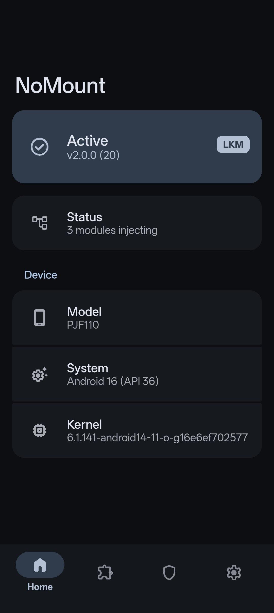
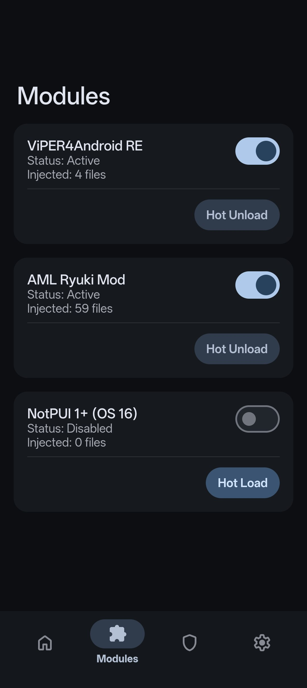
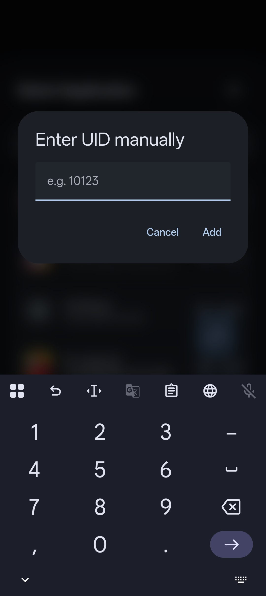
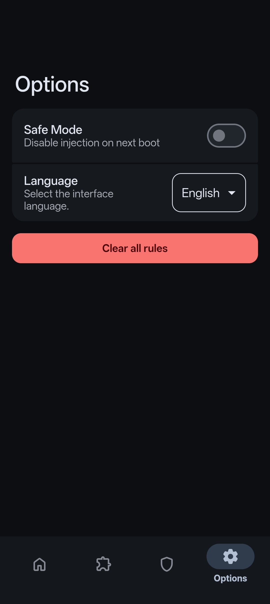
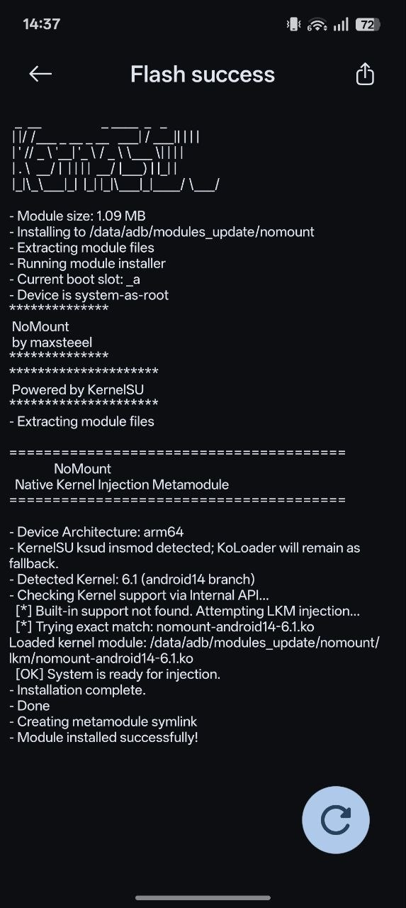

# NoMount

> **WARNING:** This project operates directly at the kernel VFS layer and is intended for research and development. Proceed with caution.

**NoMount** is a VFS (Virtual File System) path redirection framework for Android kernels.

Unlike traditional mount solutions like Magic Mount or OverlayFS that rely on modifying the mount table and polluting `/proc/mounts`, NoMount operates purely in RAM. Instead of making a real mount, it intercepts path resolution and directory iteration dynamically, making file injections completely transparent to the Android system and userspace apps without generating any mounts.

<details>
<summary><strong>View Screenshots</strong></summary>
<br>
<table>
  <tr>
    <td width="50%" align="center"><a href="assets/module_1.jpg"></a></td>
    <td width="50%" align="center"><a href="assets/module_2.jpg"></a></td>
  </tr>
  <tr>
    <td align="center"><sub><b>Home Status</b></sub></td>
    <td align="center"><sub><b>Modules List</b></sub></td>
  </tr>
  <tr>
    <td width="50%" align="center"><a href="assets/module_3.jpg"></a></td>
    <td width="50%" align="center"><a href="assets/module_4.jpg"></a></td>
  </tr>
  <tr>
    <td align="center"><sub><b>Exclusions Empty</b></sub></td>
    <td align="center"><sub><b>Exclusions Active</b></sub></td>
  </tr>
  <tr>
    <td width="50%" align="center"><a href="assets/module_5.jpg"></a></td>
    <td width="50%" align="center"><a href="assets/module_6.jpg"></a></td>
  </tr>
  <tr>
    <td align="center"><sub><b>App Selector</b></sub></td>
    <td align="center"><sub><b>Manual Entry</b></sub></td>
  </tr>
  <tr>
    <td width="50%" align="center"><a href="assets/module_7.jpg"></a></td>
    <td width="50%" align="center"><a href="assets/module_8.jpg"></a></td>
  </tr>
  <tr>
    <td align="center"><sub><b>Options</b></sub></td>
    <td align="center"><sub><b>Installation</b></sub></td>
  </tr>
</table>
</details>

## How it Works

When you set up a redirection, you provide two paths: the original file the system expects to find (e.g., `/vendor/etc/audio.conf`), and your modified file located elsewhere (e.g., `/data/local/tmp/mod.conf`).

Instead of applying global hooks in-kernel that affect the whole system, NoMount specifically modifies the directory operations of the target path directly in the RAM cache. When an application requests the original file, NoMount intercepts the call and creates a fake file representation in RAM. Once the application opens this file, NoMount internally opens your real modified file in the background and links them together. From that exact moment, any read, memory mapping (`mmap`), or data operation performed by the application is forwarded to your real file. The application reads the modified content naturally, completely unaware of the redirection.

NoMount also takes control of directory iteration. This allows you to inject entirely new files into existing system directories or completely hide existing ones (known as whiteouts). When an app or a terminal command like `ls` tries to list the contents of a directory, NoMount dynamically injects the new entries or omits the hidden ones, reflecting the changes in file lists and system calls. Also NoMount includes a dedicated UID filter. Before any path interception occurs, NoMount checks the process ID of the application making the request. If the app's UID is flagged (such as a banking app or an root detector), NoMount simply steps aside and lets the kernel resolve the path normally. The isolated app will see the stock, untouched filesystem.

This approach makes NoMount highly compatible with both read-only partitions (like `erofs`) and read-write partitions (like `ext4`), because the underlying partition is never modified. Furthermore, all communication between the userspace tool and the kernel is handled via the Linux keyring subsystem (`add_key`), completely bypassing the complications of traditional `/dev` nodes and IOCTL commands.

## How to Use It (Metamodule)

NoMount is distributed as a **Metamodule** for KernelSU (and forks) and APatch (and forks). This means it acts as a master module that dynamically intercepts and manages the mounting process of other standard modules in your system.

The NoMount module includes a built-in **WebUI** that allows you to easily control the kernel subsystem without touching the terminal:
* **Hot Load/Unload:** Enable or disable modules on the fly without rebooting.
* **App Exclusion (UID Isolation):** Select specific apps (like banking apps or anti-cheats) from a list. The WebUI extracts their UID and isolates them, ensuring they only see the stock, untouched filesystem.
* **Global Flush:** Instantly clear all redirection rules.

### Do I need a custom kernel?

Since NoMount operates at the VFS layer, it requires kernel-level integration. However, how you get this integration depends on your device:

* **Standard GKI Kernels (5.10+):** You **DO NOT** need to modify your kernel. The NoMount release ZIP includes pre-compiled LKMs (Loadable Kernel Modules) that will inject the VFS subsystem automatically upon flashing.
* **Legacy Kernels (< 5.10) and Strict Kernels:** If you are on an older kernel (e.g., 4.14, 4.19) or a strictly locked kernel (e.g., Sultan kernels with `CONFIG_INTEGRATED_MODULES=y`), the pre-compiled LKMs will not load. You will need to integrate NoMount directly into your kernel source or compile a specific LKM for your device.

For detailed instructions on how to patch your kernel source or compile a custom LKM, please read [kernel/README.md](kernel/README.md).

### How to Install the NoMount Metamodule

If your kernel already has NoMount integrated, or if you plan to use the included / compiled LKM, simply download the latest module from [Releases](https://github.com/maxsteeel/nomount/releases) or the [Nightly builds (dev branch)](https://nightly.link/maxsteeel/nomount/workflows/build/dev). Flash it via KernelSU/APatch and reboot your device.

After rebooting, just install your favorite modules (like audio mods or system tweaks) in KernelSU/APatch exactly as you normally would. NoMount's Metamodule will automatically intercept them at boot and use VFS injection instead of traditional mounts.

## How to Use It (Binary)

The subsystem is controlled via the `nm` binary. The CLI uses a simple command structure.

| Command | Description |
| --- | --- |
| `nm rule add <virtual> <real>` | Inject `real` file at `virtual` path. |
| `nm rule add --whiteout <virtual>` | Hide the file/directory at `virtual` path. |
| `nm rule del <virtual>` | Remove a specific injection rule. |
| `nm uid add <uid>` | Isolate UID. The app will see the stock filesystem. |
| `nm uid del <uid>` | Remove isolation for UID. |
| `nm rule list` | Show currently active injection rules. |
| `nm rule list --json` | Show currently active injection rules in JSON format. |
| `nm uid list` | Show currently isolated UIDs. |
| `nm clear all` | Flush all rules and UID blocks immediately. |
| `nm version` | Show the kernel subsystem version. |

### Examples

**Inject a custom library:**

```bash
# The system thinks libfoo.so is in /vendor, but it loads from /data
nm rule add /vendor/lib64/soundfx/libfoo.so /data/local/tmp/my_lib.so

```

**Hide a file completely (Whiteout):**

```bash
# Make the system think this configuration file does not exist
nm rule add --whiteout /system/etc/hidden_config.xml

```

**Hide modifications from a specific app:**

```bash
# App with UID 10256 will see the untouched filesystem, bypassing detection
nm uid add 10256

```

> **Note:** Because NoMount operates entirely in RAM, manual rules or modifications created via the CLI are lost upon reboot. The metamodule handles the persistent injection of your installed modules automatically during the boot process.

## Special Thanks

* **[Kasumi](https://github.com/Anatdx/Kasumi)**: Inspiration for this project.
* **[ZQZCC](https://github.com/ZQZCC)**: WebUI MD3E-style design.
* **[backslashxx](https://github.com/backslashxx)**: Code optimization.
* **[KernelSU](https://github.com/tiann/KernelSU)**: Root solution.
* **All testers and contributors**: Thanks for testing this project and helping to make it stable.

## Disclaimer

**NoMount** is a kernel modification tool intended for research and development. Modifying kernel behavior carries inherent risks. The developers are not responsible for bricked devices, data loss, or thermonuclear war.
